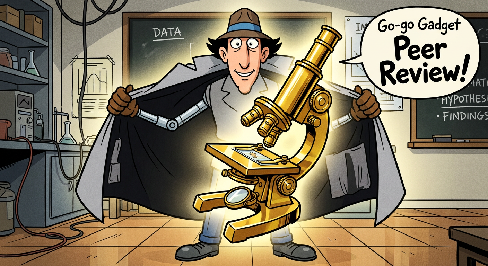

# Science Agent

Catch AI-confabulated citations before they ship.

> A README linked to [PMID 12078741](https://pubmed.ncbi.nlm.nih.gov/12078741/) as the foundational paper on Restricted Focus Viewers in vision science. The actual paper at that ID? "Determination of true ileal amino acid digestibility... in barley samples for growing-finishing pigs." The correct PMID was 12723780 — off by 645,039.

## The problem

AI coding assistants confabulate academic citations at a measurable rate. The model gets 95% right — correct author surname, approximate title, right journal, right year. Then it fabricates the remaining 5%: co-authors, exact title wording, article numbers. This is the most dangerous class of error because it passes casual review.

**How bad is it?**

| Source | Finding |
|--------|---------|
| [Our audit](FINDINGS.md) (2026) | 12% of BibTeX entries had issues in a real vision science project. Replicated at 24% in an HCI project. |
| [GhostCite](https://arxiv.org/abs/2602.06718) (Xu et al., 2026) | 14–95% hallucination rates across 13 LLMs and 40 research domains. 80.9% increase in invalid citations in published papers in 2025. |
| [NeurIPS 2025 audit](https://arxiv.org/abs/2602.05930) (Ansari, 2026) | Fabricated citations found in 53 accepted papers (~1% of acceptances). 66% were total fabrications; 27% had corrupted attributes. |
| [SPY Lab / ETH Zurich](https://spylab.ai/blog/hallucinations/) (2025) | ~0.025% of arXiv references appear hallucinated, with a clear upward trend starting early 2025. |
| [HPC conference analysis](https://arxiv.org/abs/2602.05867) (Bienz et al., 2026) | Zero suspicious citations in 2021 proceedings; 2–6% of 2025 papers affected. |

This isn't a future risk. Confabulated citations are entering the scholarly record now.

## Try it now

```bash
npx github:andyed/science-agent audit ./docs
```

Or verify a single DOI against CrossRef:

```bash
npx github:andyed/science-agent verify 10.1038/nn.2889
```

No install, no clone — runs straight from this repo.

### Why it happens

The model has distributional knowledge of a research field but can't maintain boundaries between individual papers. It knows the Carrasco lab publishes on peripheral vision, so it merges two Carrasco papers into one fake citation with the right first author + the wrong paper's article number + a fabricated title that sounds like a plausible blend of both ([compound confabulation](FINDINGS.md#barbot-et-al-2021--compound-confabulation)). It knows Shadmehr is the most prominent name in motor vigor research, so it attributes a paper to him that he didn't write ([famous-author gravity](FINDINGS.md#new-findings-from-the-replication)).

The error rate scales with AI involvement. Human-written citations: 0–7% error rate. AI-generated research surveys: 24%. And it gets worse under load — [Context Rot](https://www.trychroma.com/research/context-rot) (Chroma, 2025) showed every model degrades with longer inputs, and [Roig (2026)](https://arxiv.org/abs/2603.08274) measured fabrication rising from 1.19% at 32K tokens to 10.25% at 200K tokens across 35 models.

### The 95/5 pattern

Documented in [our audit](FINDINGS.md) and confirmed across domains:

| Error type | Example | Why it's dangerous |
|-----------|---------|-------------------|
| **Wrong title** | "Foveation for cortical magnification in visual AI" → actual: "A biologically-inspired foveated interface for deep vision models" | Sounds right. You'd have to open the paper to notice. |
| **Fabricated co-authors** | "Bowers, Tyson & Bhatt" → actual: Bowers, Gegenfurtner & Goettker | "et al." hides it entirely. |
| **Wrong DOI** | `10.1167/jov.25.1.1` resolves to a completely different paper | Looks like a valid DOI. Peer reviewers won't click it. |
| **Compound confabulation** | Two papers from the same lab merged into one fake citation | Right lab, right topic, wrong paper. |
| **Famous-author gravity** | Shadmehr attributed a paper he didn't write | The most cited name in the field becomes a magnet for misattribution. |
| **First name fabrication** | "Norick" → "Nils", "Zhuohan" → "Yijun" | Plausible names. Not the right ones. |

## The fix

**Require a DOI for every citation. Verify it against CrossRef.**

In our corpus, DOI presence had a 0% confabulation rate. CrossRef verification caught every error in both our audits. The cost is seconds per citation. The cost of propagating fabricated references through the scientific literature is not.

Science Agent automates this.

## Quick Start: Claude Code Agent

Drop `agent.md` into your project's `.claude/agents/` directory:

```bash
git clone https://github.com/andyed/science-agent.git
mkdir -p .claude/agents
cp science-agent/agent.md .claude/agents/science-agent.md
```

Then in Claude Code:
- Ask "check my citations" or "audit references in docs/"
- The agent activates automatically when it detects citation patterns
- Uses WebFetch to verify DOIs against CrossRef — no install needed

## CLI

```bash
# Install
git clone https://github.com/andyed/science-agent.git
cd science-agent && npm install

# Audit citations in a directory against a BibTeX file
node cli.js audit ./docs/specs --bibtex=./refs.bib

# Audit citations in the 10 most recent arXiv cs.AI papers
node cli.js arxiv 10

# Audit a different arXiv category
node cli.js arxiv 10 --cat=cs.CL

# Verify a single DOI against CrossRef
node cli.js verify 10.1038/nn.2889

# Search CrossRef by title
node cli.js search "Metamers of the ventral stream"
```

### Audit output

```
═══ Science Agent Audit ═══

  Directory: ./docs/specs
  BibTeX:    ./refs.bib
  Citations: 62
  In BibTeX: 33
  Orphans:   29
  With DOI:  29
  Ambiguous: 1
  Issues:    30

── Issues ──

  ⚠ [ambiguous] Pelli & Tillman (2008)
    wave3_crowding_validation.md
    matches 2 BibTeX entries — disambiguate with DOI or journal

  ℹ [orphan] Schwartz (1980)
    cmf_mip_derivation.md
    has no BibTeX entry
```

## What it catches

| Pattern | How |
|---------|-----|
| Wrong title | Fuzzy title matching against BibTeX + CrossRef |
| Fabricated co-authors | CrossRef author list verification |
| Wrong DOI | CrossRef DOI resolution — checks that the DOI points to the claimed paper |
| Compound confabulation | CrossRef + title search detects merged citations |
| Ambiguous citation | Surname+year collision detection across BibTeX entries |
| Orphan citation | Inline reference with no BibTeX entry |

## Capabilities

### Shipped
- **Citation validation** — audit inline refs against BibTeX, verify DOIs via CrossRef, flag orphans and ambiguous citations
- **Claude Code agent** — drop-in `.claude/agents/` definition, activates on citation patterns
- **CLI** — `audit`, `verify`, `search` commands

### Next
- **Claim verification** — detect wrong numbers attributed to real papers, cross-file consistency for shared parameters
- **Research corpus index** — catalog local PDFs with extracted metadata, track what's been read
- **npm package** — `npx @andyed/science-agent audit ./docs`
- **MCP server** — tools for any MCP client

## Validation: arXiv spot-check

To establish a baseline, we audited the 10 most recent cs.AI papers posted to arXiv (March 25, 2026):

```
═══ Summary ═══
Papers audited:     10
Total references:   388
References checked: 43
Issues found:       0
Issue rate:         0.0%

  ✓ No citation issues detected.
```

Zero issues in human-authored papers. This is the expected baseline — and it makes the AI-generated rates alarming by comparison:

| Source | Error rate |
|--------|-----------|
| Human-authored arXiv papers (this spot-check) | **0%** |
| Human-written project docs ([our audit](FINDINGS.md)) | 0–7% |
| AI-assisted project docs ([our audit](FINDINGS.md)) | **12–24%** |
| AI-generated citations across 13 LLMs ([GhostCite](https://arxiv.org/abs/2602.06718)) | **14–95%** |

Run it yourself: `node cli.js arxiv 10` audits the latest papers in real time.

## Related work

| Project | What it does | How science-agent differs |
|---------|-------------|--------------------------|
| [GhostCite / CiteVerifier](https://github.com/NKU-AOSP-Lab/CiteVerifier) | DBLP-based citation title verification | We use CrossRef (broader coverage), verify DOIs + authors + titles, and work as a Claude Code agent |
| [CiteAudit](https://arxiv.org/abs/2602.23452) | Multi-agent verification pipeline + web service | Not open source. Science-agent is local-first, CLI, and embeds in your dev workflow |
| [CiteME](https://arxiv.org/abs/2407.12861) | Benchmark: can LLMs identify source papers from excerpts? | Benchmark, not a tool. Different task (retrieval vs. verification) |
| [Context Rot](https://github.com/chroma-core/context-rot) | Measures general LLM degradation with context length | Methodology foundation for understanding why hallucination worsens under load |
| [Claude Scholar](https://github.com/Galaxy-Dawn/claude-scholar) | Full research lifecycle config for Claude Code (47 skills, ideation → publication) | Workflow orchestrator with prompt-based citation checking. Science-agent could serve as its verification backend via MCP |



*The arms are AI. The microscope is yours.*

[**andre-inter-collab-llc/research-workflow-assistant**](https://github.com/andre-inter-collab-llc/research-workflow-assistant) — André Nogueira's open-source Research Workflow Assistant: a VS Code + GitHub Copilot stack of custom agents and MCP servers (PubMed, OpenAlex, Semantic Scholar, Europe PMC, CrossRef, Zotero) for systematic reviews, academic writing, data analysis, and ICMJE-compliant authorship. Different domain from this project (biomedical research workflows vs citation verification), same underlying bet: researchers already have VS Code, git, Python, R, Quarto, and Markdown — give them an LLM with the right agent scaffolding and they can assemble their own compliant research assistants in weeks instead of waiting for a platform. Science-agent is built on similar principles (Claude Code agent discipline, conventional-commit workflow, FINDINGS.md as a first-class audit artifact) but targeted at the narrow problem of catching AI-fabricated citations rather than a generic multi-domain workflow; RWA is the systematic, biomedical-workflows version of the same idea.

## Origin

Built after discovering AI-confabulated citations in [Scrutinizer](https://github.com/andyed/scrutinizer2025), an open-source peripheral vision simulator. A collaborator checked the arxiv reference to his own paper during a meeting and found the title was wrong. The [full audit](FINDINGS.md) revealed systematic patterns that replicated across a second project in a different domain.

See [FINDINGS.md](FINDINGS.md) for the complete audit with methodology, data, and patterns.

## License

MIT
